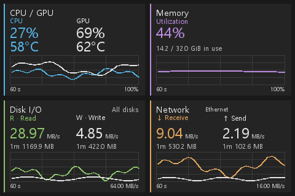

<p align="center">
  
</p>

# Monitor35

**PC 상태를 책상 위 작은 화면에.** Turing 3.5인치 USB 화면을 위한 Windows 모니터링 앱입니다.
CPU·GPU·메모리·디스크·네트워크를 한눈에 보고, 미리보기에서 카드 배치와 색상을 편집할 수 있습니다.

<p align="center">
  
</p>

<p align="center"><sub>실제 앱 렌더러로 만든 480 × 320 기본 테마 예시입니다. 수치와 차트는 설명용 샘플이며, 실기기 사진이 아닙니다.</sub></p>

**[빠른 시작](#빠른-시작)** · **[화면 읽기](#화면-읽기)** · **[화면 꾸미기](#화면-꾸미기)** · **[문제 해결](#문제-해결)** · **[개발](#개발)**

## 주요 기능

- **실시간 대시보드** — 4개 카드와 최근 60초 차트, 디스크·네트워크의 최근 1분 사용량.
- **미리보기와 배치 편집** — 카드 드래그, 숫자 크기·색상·밝기 조절, 저장과 실행 취소.
- **트레이 상주** — 창을 숨겨도 갱신을 계속하며, 로그인 자동 시작을 선택할 수 있습니다.
- **연결 자동 복구** — USB 오류와 절전 복귀를 감지해 포트를 다시 찾고 화면을 갱신합니다.

장치 없이도 미리보기를 사용할 수 있습니다. 센서 데이터와 로그는 로컬에서 처리합니다.
기존 UsbMonitor의 설치·테마·자동 실행·전원 설정은 변경하지 않습니다.

## 사용 환경

| 항목 | 조건 |
| --- | --- |
| 운영체제 | Windows |
| Python | **3.12 기준**, tkinter 포함. `setup.cmd`가 사용하는 `python` 명령으로 실행 가능해야 합니다. |
| USB 화면 | Turing 3.5인치, **480 × 320 가로 화면**. 장치 ID `USB35INCHIPS`, `USB35INCHIPSV2`를 탐색합니다. |
| 실기기 확인 모델 | `USB35INCHIPSV2`. 다른 보드·펌웨어의 호환성은 별도 확인이 필요합니다. |
| GPU 센서 | `nvidia-smi`를 사용할 수 있는 첫 번째 NVIDIA GPU. AMD·Intel GPU 센서는 미지원입니다. |
| CPU 온도 | 선택 기능. [별도 센서 준비](#온도-센서-선택)가 필요합니다. |

> **연결 전:** 기존 UsbMonitor에서 작업 중인 테마를 저장하고 프로그램을 종료하세요. 같은 USB 화면은 한 프로그램만 사용할 수 있습니다.

## 빠른 시작

### 1. 다운로드와 설치

이 저장소의 **Code → Download ZIP**으로 내려받아 압축을 풀거나 Git으로 복제합니다.

```powershell
git clone https://github.com/Somdle/monitor.git
cd monitor
```

프로젝트 폴더에서 PowerShell을 열고 실행합니다. ZIP으로 받았다면 압축을 푼 폴더에서 시작하세요.

```powershell
python --version
.\setup.cmd
```

`python --version`으로 Python 버전을 먼저 확인하세요. `setup.cmd`는 프로젝트 안에 `.venv`를 만들고
필요한 패키지를 설치합니다. 처음 설치할 때는 인터넷 연결이 필요합니다.

### 2. 미리보기 열기

```powershell
.\start.cmd
```

탐색기에서 **start.cmd**를 더블클릭해도 됩니다. 이후 실행할 때는 이 파일만 열면 됩니다.
기본 실행은 **미리보기 모드**이며, USB 화면에는 아직 전송하지 않습니다.

### 3. USB 화면 연결

1. 기존 UsbMonitor를 종료하고 USB 화면 **한 대**를 연결합니다.
2. Monitor35 오른쪽 위의 **화면 연결**을 누릅니다. 초기화에 수 초 걸릴 수 있습니다.
3. 창 아래의 연결 상태와 실제 USB 화면을 확인합니다.
4. 화면이 거꾸로 보이면 **실제 화면 180° 회전**을 켜고 **테마 저장**을 누릅니다.

**연결 해제**를 누르면 포트를 반납합니다. 마지막으로 표시한 화면은 LCD에 남습니다.

## 화면 읽기

| 카드 | 표시 정보 | 차트 |
| --- | --- | --- |
| CPU / GPU | CPU·GPU 사용률과 온도 | 색 선: CPU / 흰 선: GPU |
| Memory | 메모리 사용률, 사용 중 / 전체 용량 | 메모리 사용률 |
| Disk I/O | 전체 물리 디스크의 읽기(R)·쓰기(W) 속도, 최근 1분 사용량 | 색 선: 읽기 / 흰 선: 쓰기 |
| Network | 유선·무선 전체 합산 또는 지정 어댑터의 수신(↓)·송신(↑) 속도, 최근 1분 사용량 | 색 선: 수신 / 흰 선: 송신 |

- **MB/s**는 초당 백만 바이트입니다. 디스크와 네트워크에 같은 단위를 사용합니다.
- 모든 차트는 **최근 60초**를 표시합니다. CPU·메모리는 0~100%, 디스크·네트워크는 자동 눈금을 사용합니다.
- **1m**은 최근 60초 동안 측정한 전송량(MB)입니다. 시작 후 1분 미만이거나 수집 공백이 있으면 측정된 구간만 합산합니다.
- **`--` / `--°C`**는 아직 측정값이 없거나 센서를 사용할 수 없다는 뜻입니다. 첫 측정·절전 복귀 직후의 속도는 다음 샘플에서 갱신됩니다.

디스크는 모든 물리 디스크의 읽기끼리·쓰기끼리 합산하며, 용량이나 활성 시간(%)은 표시하지 않습니다.
네트워크 기본값은 **전체 합산**으로 유선·무선의 수신끼리·송신끼리 더합니다.
기존에 특정 어댑터를 저장했다면 **네트워크 어댑터 → 전체 합산**을 선택하고 저장하세요.

<details>
<summary>네트워크 합산과 1분 사용량 계산 방식</summary>

전체 합산은 루프백을 제외한 활성 어댑터를 모두 합산합니다. 예를 들어 유선 수신 2 MB/s와
무선 수신 3 MB/s는 5 MB/s로 표시되며, 차트와 1분 사용량에도 같은 합산이 적용됩니다.
VPN·가상 어댑터도 활성 상태이면 포함되므로 같은 트래픽이 중복 집계될 수 있습니다.
필요하면 편집기에서 특정 어댑터를 지정하세요. 기존 자동 선택 설정은 전체 합산으로 바뀝니다.
어댑터·디스크 목록 변경 또는 개별 카운터 초기화 직후에는 기준값을 다시 잡고 다음 구간부터 측정합니다.

1분 사용량은 최근 60초와 겹치는 측정 구간을 합산합니다. 경계에 걸친 샘플은 해당 구간의 평균 속도로 비례 계산합니다.

</details>

## 화면 꾸미기

| 하고 싶은 일 | 조작 |
| --- | --- |
| 카드 이동 | 미리보기에서 카드를 드래그하거나, 오른쪽 **가로 위치·세로 위치 → 위치 · 크기 적용** |
| 숫자 크기 변경 | **선택 항목 → 숫자 크기 → 위치 · 크기 적용** (16~28px, 기본 24px) |
| 카드 색상 변경 | **차트 색상 선택**. 대표 숫자와 차트에 반영됩니다. |
| LCD 밝기 조절 | **화면 밝기 → 밝기 적용** (0~50) |
| LCD 방향 뒤집기 | **실제 화면 180° 회전**. 편집 미리보기와 드래그 방향은 정방향을 유지합니다. |
| 저장 / 되돌리기 | **테마 저장** (`Ctrl+S`), **실행 취소** (`Ctrl+Z`), **저장본 불러오기** |

연결 중에는 편집 내용이 실제 화면에도 반영됩니다. **테마 저장**으로 다음 실행에도 유지할 수 있습니다.
창을 숨기거나 완전히 종료할 때도 미저장 변경을 자동 저장합니다.

## 백그라운드와 자동 시작

**창의 X 버튼은 종료가 아니라 트레이로 숨기기입니다.** 연결된 화면은 계속 갱신됩니다.

- **숨기기:** 창의 X 또는 **백그라운드로**.
- **다시 열기:** 작업 표시줄의 숨겨진 아이콘 영역에서 Monitor35 아이콘 클릭, 또는 우클릭 → **편집기 열기**.
- **종료:** 편집기나 트레이 메뉴에서 **완전히 종료**.

트레이에는 문서 상단과 같은 남색·청록색 모니터 아이콘이 표시됩니다.
Monitor35를 다시 실행해도 기존 편집창이 열립니다. 두 번째 실행의 옵션은 기존 연결과 설정을 덮어쓰지 않습니다.

처음부터 트레이에서 실행하며 USB 화면에 연결하려면:

```powershell
.\start.cmd --background --connect
```

`--background`만 사용하면 USB 전송 없이 실행됩니다.
트레이 생성이나 테마 저장에 실패하면 편집창을 유지하며, 숨겨진 상태에서 작업 오류가 발생하면 창을 다시 엽니다.

### Windows 로그인 시 자동 시작

편집기의 **Windows 로그인 시 백그라운드로 시작**을 켜면 현재 사용자 시작프로그램에 등록됩니다.
다음 로그인부터 저장된 테마로 트레이에서 실행하고 USB 화면에 자동 연결합니다. 체크를 끄면 등록이 해제됩니다.

- 설치나 일반 실행만으로 자동 등록하지 않습니다. 등록할 때 미저장 테마를 먼저 저장합니다.
- 작업 관리자에서 Monitor35 시작을 사용 안 함으로 설정했다면 그곳에서 다시 허용해야 합니다.
- 설치 폴더를 옮기기 전 등록을 해제하고, 이동 후 다시 등록하세요.
- 일반 사용자 권한으로 실행되며, CPU 온도용 권한을 자동 승격하지 않습니다.

## 온도 센서 (선택)

**NVIDIA GPU**는 드라이버의 `nvidia-smi`로 사용률과 온도를 읽습니다. 조회 실패 시 `--`로 표시하고 재시도합니다.
센서가 없어도 다른 항목과 미리보기는 사용할 수 있습니다.

**CPU 온도**는 LibreHardwareMonitor 0.9.6과 PawnIO 드라이버가 필요합니다.
기본 설치를 마친 뒤, 프로젝트 폴더의 PowerShell에서 센서 라이브러리를 준비할 수 있습니다.

```powershell
.\setup-temperature.ps1
```

이 스크립트는 해시를 확인한 라이브러리를 `.venv/hardware/LibreHardwareMonitor`에 준비합니다.
**PawnIO 드라이버는 자동 설치하지 않습니다.** 드라이버 설치에는 별도 관리자 승인이 필요하며,
환경에 따라 Monitor35도 관리자 권한으로 실행해야 합니다.
CPU package/Tctl/Tdie 센서만 사용하며, 사용할 수 없거나 5초 넘게 갱신되지 않으면 `--°C`로 표시합니다.

## 문제 해결

| 증상 | 확인할 내용 |
| --- | --- |
| `python`을 찾을 수 없거나 설치에 실패함 | Python 3.12와 tkinter 설치, `python --version`을 확인한 뒤 `setup.cmd`를 다시 실행하세요. |
| `Run setup.cmd first.`가 표시됨 | 프로젝트 폴더에서 `setup.cmd`를 먼저 실행하세요. |
| COM 포트 액세스 거부 | 기존 UsbMonitor나 다른 장치 제어 프로그램을 종료하세요. |
| 장치가 없거나 여러 대 감지됨 | 지원 화면 한 대만 연결하고 아래 `--devices` 명령으로 확인하세요. |
| 초기화 후 연결되지 않음 | **재연결 시 장치 초기화**를 해제한 뒤 다시 연결해 보세요. |
| 화면이 거꾸로 표시됨 | **실제 화면 180° 회전**을 켜고 테마를 저장하세요. |
| 네트워크 값이 예상과 다름 | **네트워크 어댑터**에서 실제 사용하는 어댑터를 선택하세요. |
| 온도가 `--°C`로 표시됨 | [온도 센서 조건](#온도-센서-선택)을 확인하세요. 지원되지 않거나 오래된 측정값도 이렇게 표시됩니다. |
| 창을 닫았는데 계속 실행됨 | X는 트레이로 숨깁니다. **완전히 종료**를 선택하세요. |
| 설정 오류로 시작되지 않음 | `data/theme.json`을 백업하고 `data/monitor.jsonl`을 확인하세요. 잘못된 테마는 자동으로 덮어쓰지 않습니다. |

### 연결 자동 복구

절전 진입 시 화면 끄기 명령을 보내고 포트를 닫습니다. 복귀 이벤트나 실행 시간 공백을 감지하면 다시 연결합니다.
USB 오류 시에는 **1~15초 간격**으로 장치를 재탐색하므로 COM 번호를 고정할 필요가 없습니다.
재연결 시 설정에 따라 초기화하고, 방향·밝기를 적용한 뒤 화면 전체를 다시 보냅니다.

정상 상태에서는 변경 영역만 전송하고 30초마다 전체 화면을 갱신합니다.
창 아래에서 연결 상태·전송 수·실패 수·최근 전송 시간을 확인할 수 있습니다.
펌웨어가 멈춘 경우 USB 재삽입이 필요할 수 있습니다.

### 진단 명령

프로젝트 폴더의 PowerShell에서 실행합니다.

```powershell
# 지원 장치 목록
.\.venv\Scripts\python.exe -m monitor35 --devices

# USB 전송 없이 3초간 센서를 읽고 preview.png 생성
.\.venv\Scripts\python.exe -m monitor35 --smoke 3 --data-dir .tmp/preview
```

<details>
<summary>실기기 전송 진단</summary>

Monitor35와 기존 UsbMonitor를 완전히 종료하고, USB 화면 한 대를 연결한 뒤 실행하세요.

```powershell
.\.venv\Scripts\python.exe -m monitor35 --connect --smoke 30 --data-dir .tmp/device
```

`--smoke`는 정상 종료 시 0, worker 오류 또는 마지막 실기기 전송 실패 시 1을 반환합니다.
앱이 이미 실행 중이면 단일 실행 처리로 기존 창만 열릴 수 있으므로 먼저 종료해야 합니다.
전송 성공은 OS 직렬 쓰기 완료 기준입니다. LCD 응답 확인(ACK)이 없어 실제 화면 출력과 절전·복귀는 별도로 확인해야 합니다.

</details>

## 설정과 지원 범위

| 경로 | 내용 |
| --- | --- |
| `data/theme.json` | 저장한 배치·색상·밝기·회전·어댑터 설정 |
| `data/monitor.jsonl` | 로컬 진단 로그. 1MB 단위로 회전합니다. |
| `src/monitor35/assets/monitor35.ico` | Windows 바로가기에 사용할 아이콘 |

`--data-dir`로 테마와 로그 저장 폴더를 지정할 수 있습니다.
현재 **세로 화면, 배경 이미지, 원본 UsbMonitor의 `.data` 테마 가져오기, AMD·Intel GPU 센서**는 지원하지 않습니다.

<details>
<summary>기존 사용자: 테마 이전과 업데이트 후 실행</summary>

버전 1 테마는 버전 2의 4분할 배치로 이전합니다. 밝기·재연결 초기화·회전은 유지하고,
기존 위치·색상·시계는 새 디자인으로 바뀝니다. 첫 저장 시 원본은 `data/theme.v1.json`에 보관합니다.
이전 앱으로 되돌릴 때는 앱을 종료한 후 이 파일을 `theme.json`으로 복사하세요.

단일 실행 기능이 없는 이전 버전에서 업데이트했다면 기존 앱을 한 번 완전히 종료한 뒤 `start.cmd`로 다시 실행하세요.

</details>

## 개발

Python 3.12 · Tkinter · Pillow 기반입니다. `setup.cmd`는 개발용 의존성도 함께 설치합니다.

- [개발 명령과 작업 규칙](AGENTS.md)
- [아키텍처와 모듈 구조](docs/architecture/overview.md)
- [설계 결정](docs/architecture/decisions.md)
- [검증 기록과 실기기 검증 한계](docs/verification.md)
- [README 이미지 정보](docs/assets/README.md)

## 라이선스와 출처

**GPL-3.0-or-later.** 장치 프로토콜은
[smartscreen-driver](https://github.com/hchargois/smartscreen-driver) 0.2.3을 사용하며,
드라이버의 원 프로젝트는 [turing-smart-screen-python](https://github.com/mathoudebine/turing-smart-screen-python)입니다.
의존성 라이선스와 선택 센서 출처는 [THIRD_PARTY_NOTICES.md](THIRD_PARTY_NOTICES.md)를 참고하세요.
